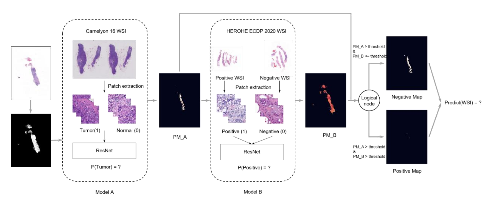

# HEROHE_Macaroon
Macaroon team's method for HEROHE challenge.



## Requirements
- fastai 2.7.5
- openslide-python 1.2.0

## Reference
If you are interested in our work and want to cite it, please acknowledge the following paper:

```
@article{conde2021herohe,
  title={HEROHE Challenge: assessing HER2 status in breast cancer without immunohistochemistry or in situ hybridization},
  author={Conde-Sousa, Eduardo and Vale, Jo{\~a}o and Feng, Ming and Xu, Kele and Wang, Yin and Della Mea, Vincenzo and La Barbera, David and Montahaei, Ehsan and Baghshah, Mahdieh Soleymani and Turzynski, Andreas and others},
  journal={arXiv preprint arXiv:2111.04738},
  year={2021}
}
```
